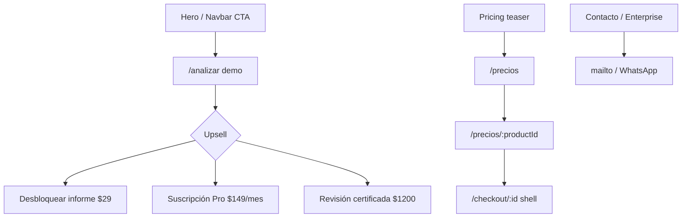

<div align="center">


# FastQA

**Quality engineering · Pruebas automatizadas · Ciberseguridad aplicada a software**

> Automatiza tus pruebas, potencia tu software.  
> Estabilidad, seguridad y eficiencia para equipos que necesitan releases confiables.

[](https://react.dev)
[](https://www.typescriptlang.org)
[](https://vitejs.dev)
[](https://tailwindcss.com)
[](https://www.framer.com/motion)
[](https://vercel.com)
[](#stack-y-design-system)

**[Sitio live](https://fastqa.dev)** · **[Analizador](https://fastqa.dev/analizar)** · **[Precios](https://fastqa.dev/precios)** · **[Design System](./DESIGN_SYSTEM.md)**

</div>

---

## ¿Qué es FastQA?

**FastQA** es la landing comercial B2B de una marca de *quality engineering*: automatización de pruebas, rendimiento, CI/CD y revisión certificada antes de producción.

Nació para equipos de producto, engineering y QA que necesitan **releases estables sin frenar la entrega** — incluyendo apps construidas con *vibe coding* (Cursor, Lovable, Bolt, Copilot).

| Problema | Respuesta FastQA |
|---|---|
| Shippear sin leer línea a línea el código generado por IA | Analizador demo + informe priorizado P0–P3 |
| Regresiones en cada deploy | Suites automatizadas + integración CI/CD |
| Ir a producción sin evidencia de calidad | Revisión certificada + **certificado digital FastQA** |
| Falta de proceso / playbook de QA | Playbook digital + auditoría express |

> **Estado del producto:** el analizador (`/analizar`) y el checkout (`/checkout/:id`) son **carcasa comercial / demo**. Los pagos reales llegarán después; hoy el flujo muestra el producto y captura interés.

---

## Flujo de la landing

La home (`/`) está orquestada en [`src/pages/Home.tsx`](./src/pages/Home.tsx). Copy ES en [`src/i18n/dictionaries/es/`](./src/i18n/dictionaries/es/).

### Secciones (orden real)

| # | Sección | ID | Qué comunica | CTA principal |
|---:|---|---|---|---|
| 0 | **Navbar** | — | Navegación fija + idioma + tema | **Analizar ahora** → `/analizar` |
| 1 | **Hero** | `#hero` | *“Automatiza tus pruebas, potencia tu software”* — testing que garantiza estabilidad, seguridad y eficiencia | **Analizar proyecto** · **Ver precios** |
| 2 | **Trust** | `#trust` | *“Confían en nosotros”* — LogoLoop de partners/clientes | — |
| 3 | **Analyzer teaser** | `#analyzer` | *“¿Shippeaste con Cursor o Lovable?”* — escaneo URL/repo, indicios gratis, informe de pago | **Probar el analizador** |
| 4 | **Pricing teaser** | `#pricing` | Highlights: desbloquear informe, Pro, revisión certificada · toggle COP/USD | **Ver todos los planes** |
| 5 | **Services** | `#services` | Cuatro pilares de servicio (ver abajo) | **Ver planes y precios** |
| 6 | **About** | `#about` | Misión desde 2018 · stats · valores | — |
| 7 | **Method** | `#method` | Diagnóstico → Automatización → Escala y soporte | — |
| 8 | **Testimonials** | `#testimonials` | Relatos representativos de calidad | — |
| 9 | **FAQ** | `#faq` | 8 preguntas sobre automatización, stack y analizador | **Contáctanos** |
| 10 | **Contact** | `#contact` | Demo sin compromiso · email / teléfono / WhatsApp | **Enviar mensaje** |
| 11 | **Footer** | — | Tagline + legal | Privacidad · Términos |

### Trust strip

Marcas en el carrusel (`public/assets/clients/`):

<p align="center">
  
  &nbsp;&nbsp;
  
  &nbsp;&nbsp;
  
  &nbsp;&nbsp;
  
  &nbsp;&nbsp;
  
  &nbsp;&nbsp;
  
</p>

### Servicios

| Servicio | Enfoque | Beneficios |
|---|---|---|
| **Automatización de Pruebas** | Unitarias, integración y E2E | Detección temprana · cobertura · menos tiempo en QA · reportes |
| **Testing de Rendimiento** | Carga, cuellos de botella, UX | Usuarios concurrentes · puntos críticos · tiempos de respuesta · capacidad |
| **Integración con CI/CD** | Validación en el pipeline | Deploys más seguros · feedback inmediato · menos regresiones |
| **Consultoría en QA** | Mejores prácticas y formación | Estrategias · capacitación · mejora continua · auditoría |

### About — números y valores

| Métrica | Valor |
|---|---|
| Satisfacción de clientes | **98%** |
| Proyectos completados | **+200** |
| Años de experiencia | **5+** |

**Valores:** Calidad sin compromiso · Innovación constante · Colaboración · Enfoque basado en datos.

### Método

```text
1. Diagnóstico     →  riesgos, stack, flujos críticos
2. Automatización  →  E2E / API / unit + reportes desde el día uno
3. Escala          →  cobertura, formación del equipo, suites estables
```

### Funnel de conversión



---

## Catálogo de precios

Fuente de verdad: [`src/data/pricing.ts`](./src/data/pricing.ts) (USD) + copy en [`src/i18n/dictionaries/es/pricing.ts`](./src/i18n/dictionaries/es/pricing.ts).  
La UI convierte a **COP en vivo** (fallback de referencia: **1 USD ≈ 4.100 COP**).

> **Pagos reales próximamente** — el checkout es una carcasa comercial. **7 ofertas activas.**

### Highlights en la home

`unlock-report` · `pro` · `review`

---

### Suscripciones

*Acceso continuo a la plataforma FastQA: automatización, reportes y soporte según el plan.*

| Plan | USD | COP ≈ | Intervalo | Destacado | Incluye |
|---|---:|---:|---|---|---|
| **Starter** | **$49** | ~$200.900 | /mes | — | Hasta 2 proyectos · 500 ejecuciones/mes · Reportes HTML + CSV · Soporte correo (48h) |
| **Pro** | **$149** | ~$610.900 | /mes | **Recomendado** | Hasta 10 proyectos · 5.000 ejecuciones/mes · CI/CD GitHub/GitLab · Alertas Slack/email · Soporte prioritario (24h) |
| **Team** | **$399** | ~$1.635.900 | /mes | — | Proyectos ilimitados · 20.000 ejecuciones/mes · Roles y permisos · Historial 12 meses · Onboarding 1 sesión |

---

### Revisión con ingenieros

*Sesiones con ingenieros para validar, certificar y endurecer tu calidad antes de producción.*

| Producto | USD | COP ≈ | Intervalo | Destacado | Incluye |
|---|---:|---:|---|---|---|
| **Auditoría express** | **$650** | ~$2.665.000 | pago único | — | ~5 días hábiles · Scorecard de madurez QA · Roadmap 30/60/90 · Checklist de release |
| **Revisión certificada** | **$1.200** | ~$4.920.000 | pago único | **Recomendado** | Kickoff 48h · Funcional + smoke crítico · Informe P0–P3 · Walkthrough 60 min · **Certificado digital FastQA** |

---

### Documento / producto digital

*Playbook, desbloqueo del informe del analizador y activos para estandarizar QA desde el día uno.*

| Producto | USD | COP ≈ | Intervalo | Destacado | Incluye |
|---|---:|---:|---|---|---|
| **Playbook QA FastQA** | **$79** | ~$323.900 | pago único | — | PDF + plantillas Notion/Docs · Checklist de release · Matriz de severidad · Guía smoke vs regresión · Updates 6 meses |
| **Desbloquear informe completo** | **$29** | ~$118.900 | pago único | **Recomendado** | Informe sin blur · Hallazgos P0–P3 · Secretos y auth · Checklist de release · Upsell a Pro/Team |

---

### Enterprise

¿SSO, SLAs, volúmenes altos o un squad dedicado? Cotizamos sin compromiso → **Hablar con ventas** (`/#contact`).

### Flujo de compra

1. `/precios` — catálogo completo + toggle COP/USD  
2. `/precios/:productId` — detalle, features, **Continuar al pago**  
3. `/checkout/:productId` — formulario (nombre, email, empresa) · CTA *“Pagar … (próximamente)”* · mensaje de interés registrado  

---

## Rutas de la aplicación

| Ruta | Página | Descripción |
|---|---|---|
| `/` | Home | Landing completa (11 secciones) |
| `/analizar` | Analyzer | Demo de escaneo URL / `owner/repo` |
| `/precios` | Pricing | Catálogo de 7 productos |
| `/precios/:productId` | Product detail | Detalle + CTA a checkout |
| `/checkout/:productId` | Checkout | Carcasa de pago (sin cobro real) |
| `/privacidad` | Legal | Privacidad (stub) |
| `/terminos` | Legal | Términos (stub) |

---

## Analizador de proyectos

Pensado para ingeniería clásica y apps *vibe-coded*:

- Input: URL `https://…` o repo `owner/repo`
- Informe demo: **2–3 hallazgos gratis**; el resto bloqueado (secretos, auth IA, RLS/CORS, checklist de release)
- Upsell: **$29** desbloqueo · o suscripción **Pro / Team**

> Hoy **no** se ejecuta ni se sube tu código. Es una carcasa comercial; el escaneo real se anunciará en `/analizar`.

---

## FAQ (resumen)

| Pregunta | Respuesta corta |
|---|---|
| ¿Por qué automatizar vs manual? | Velocidad, consistencia, regresiones y cobertura en ciclos ágiles |
| ¿Cuánto tarda implementar? | Pequeño: 2–4 semanas · Grande: 1–3 meses (enfoque gradual) |
| ¿Qué stack usan? | Cypress, Selenium, Playwright · Appium/Detox · Postman/supertest · Jest/JUnit/PyTest |
| ¿Cómo se integran al equipo? | Consultoría, capacitación, llave en mano o equipo mixto |
| ¿Soporte post-implementación? | Sí: mantenimiento, falsos positivos, optimización, formación |
| ¿El analizador escanea de verdad? | Aún no — flujo demo comercial |

---

## Equipo — ingenieros principales

Ingenieros de la **Universidad Católica de Pereira** (Ingeniería de Sistemas y Telecomunicaciones) que impulsan el producto, la automatización, la entrega y el aseguramiento de seguridad detrás de las **garantías y la certificación FastQA**.

<table>
  <tr>
    <td width="50%" valign="top" align="center">
      <br />
      <h3>Juan Alejandro Urueña Serna</h3>
      <p><strong>Full-stack &amp; automatización de pruebas</strong></p>
      <p align="left">
        Owner del repositorio <code>FastQA-HomePage</code>. Full-stack (Python/React) con foco en calidad entregable y automatización con <strong>Cypress / Selenium</strong>. Experiencia en CRM, funnels y datos/IA aplicada.
      </p>
      <p align="left"><em>Aporte a certificación:</em> tooling de QA automatizado y la carcasa comercial que vende el informe y la revisión certificada.</p>
      <p>
        <a href="https://github.com/Uruena2603">GitHub</a> ·
        <a href="https://www.linkedin.com/in/juan-alejandro-urue%C3%B1a-serna-1a15122a2">LinkedIn</a> ·
        <a href="https://uruena2603.github.io/Personal-blog/">Blog</a><br />
        <code>alejourus2003@gmail.com</code> · Pereira, Colombia
      </p>
    </td>
    <td width="50%" valign="top" align="center">
      <br />
      <h3>Nicolás Ceballos Brito</h3>
      <p><strong>Ingeniería de producto y calidad en el SDLC</strong></p>
      <p align="left">
        Full-stack / cross-platform y AI engineer trainee. Semillero de investigación <strong>Testing Automatizado</strong> (UCP). App Lead en Prosavis. Portfolio: <a href="https://nicolasceballosbrito.com">nicolasceballosbrito.com</a>.
      </p>
      <p align="left"><em>Aporte a certificación:</em> prácticas de QA en el ciclo de vida, CI/CD y liderazgo de producto orientado a releases confiables.</p>
      <p>
        <a href="https://github.com/Nico2603">GitHub</a> ·
        <a href="https://www.linkedin.com/in/nicolas-ceballos-brito">LinkedIn</a> ·
        <a href="https://twitter.com/NicolasCBrito">X</a> ·
        <a href="https://nicolasceballosbrito.com">Web</a><br />
        <code>nicolasceballosbrito@gmail.com</code> · Pereira, Colombia
      </p>
    </td>
  </tr>
  <tr>
    <td width="50%" valign="top" align="center">
      <br />
      <h3>Camilo Castañeda Yepes</h3>
      <p><strong>Entrega de producto e implementación</strong></p>
      <p align="left">
        App Lead Developer en Prosavis. Experiencia en servidores, bases de datos, ML y mobile. Participación en grupos de investigación de programación y <strong>software testing</strong>; maratones de programación competitiva.
      </p>
      <p align="left"><em>Aporte a certificación:</em> ownership de entrega, implementación robusta y cultura de testing en producto real.</p>
      <p>
        <a href="https://github.com/camCy">GitHub</a> ·
        <a href="https://www.linkedin.com/in/camilo-castaneda-yepes-a24a5628a">LinkedIn</a> ·
        <a href="https://twitter.com/C4milo_CY">X</a><br />
        Pereira, Colombia
      </p>
    </td>
    <td width="50%" valign="top" align="center">
      <br />
      <h3>Juan David García Acevedo</h3>
      <p><strong>Aseguramiento de seguridad y calidad</strong></p>
      <p align="left">
        Certificaciones <strong>eJPT · Web-RTA · AD-RTS · CRTA</strong>. Red Team / ethical hacking, bug bounty y CI/CD. Tesis meritoria en NLP. Sitio: <a href="https://liandd.github.io">liandd.github.io</a> · ORCID · Hack The Box.
      </p>
      <p align="left"><em>Aporte a certificación:</em> visión ofensiva de seguridad que endurece las garantías FastQA (secretos, auth, superficie de ataque).</p>
      <p>
        <a href="https://github.com/liandd">GitHub</a> ·
        <a href="https://www.linkedin.com/in/juan-garciaa2">LinkedIn</a> ·
        <a href="https://liandd.github.io">Web</a> ·
        <a href="https://orcid.org/0009-0007-7575-2660">ORCID</a> ·
        <a href="https://profile.hackthebox.com/profile/019ed2b2-ba04-7029-974b-93c9acd04537">HTB</a><br />
        <a href="https://twitter.com/lianndd_">X</a> · Pereira, Colombia
      </p>
    </td>
  </tr>
</table>

### Matriz de experticia (garantías FastQA)

| Dimensión | Juan Alejandro | Nicolás | Camilo | Juan David |
|---|:---:|:---:|:---:|:---:|
| Automatización de pruebas (Cypress/Selenium/E2E) | ●●● | ●● | ●● | ● |
| Calidad en SDLC / producto | ●● | ●●● | ●●● | ●● |
| Entrega / App Lead | ●● | ●●● | ●●● | ●● |
| Seguridad / Red Team / bug bounty | ● | ● | ● | ●●● |
| CI/CD y pipelines | ●● | ●●● | ●● | ●●● |
| Certificación / informe / release checklist | ●●● | ●● | ●● | ●●● |

---

## Stack y design system

| Capa | Tecnología |
|---|---|
| UI | React 19 · TypeScript · Vite 8 |
| Estilos | Tailwind CSS 4 · tokens en `src/styles/tokens.css` |
| Motion | Framer Motion · Lenis · React Bits (Aurora, Particles, DecryptedText, SpotlightCard, LogoLoop) + `ogl` |
| Routing / SEO | react-router-dom 7 · react-helmet-async · JSON-LD |
| i18n | `LanguageProvider` ES ↔ EN (default `es`) |
| Analytics | `@vercel/analytics` · `@vercel/speed-insights` |
| FX | Open ER / Frankfurter → COP (fallback 4100) |

### Marca

| Token | Hex | Uso |
|---|---|---|
| Slate navy | `#223E54` | Texto, logo, nav |
| Coral | `#D55C4D` | CTA / acento |
| Blue deep | `#1A3348` | Fondos dark |

**Tipografía:** Space Grotesk (display) · Plus Jakarta Sans (body) · IBM Plex Mono (labels tech).  
**Tema dual** light/dark obligatorio — ver checklist en [`DESIGN_SYSTEM.md`](./DESIGN_SYSTEM.md).

### Assets

| Asset | Ruta |
|---|---|
| Logo oficial | [`public/logo.png`](./public/logo.png) |
| Trust clients | `public/assets/clients/*` |
| Legacy (no usar como marca) | `public/assets/logo.svg`, `logo-white.svg` |

---

## Desarrollo local

```bash
npm install
npm run dev      # servidor de desarrollo
npm run build    # tsc + vite build → dist/
npm run lint     # ESLint
npm run preview  # preview del build
```

**Deploy:** Vercel (`vercel.json` con rewrite SPA). Output: `dist/`.

---

## Contacto

| Canal | Valor |
|---|---|
| Email comercial | [contacto@fastqa.com](mailto:contacto@fastqa.com) |
| Soporte | [soporte@fastqa.com](mailto:soporte@fastqa.com) |
| Teléfono / WhatsApp | +52 (55) 1234-5678 · [wa.me](https://wa.me/525512345678) |
| Sitio | [https://fastqa.dev](https://fastqa.dev) |
| Repo | [github.com/Uruena2603/FastQA-HomePage](https://github.com/Uruena2603/FastQA-HomePage) |

---

## Documentación relacionada

- [`DESIGN_SYSTEM.md`](./DESIGN_SYSTEM.md) — brand, tema dual, i18n, tipografía, React Bits  
- Diccionarios ES/EN — `src/i18n/dictionaries/`  
- Catálogo de precios — `src/data/pricing.ts`

---

<div align="center">

**FastQA** — calidad, certificación y garantías para cada release.

Hecho con React · TypeScript · Tailwind · Framer Motion

[fastqa.dev](https://fastqa.dev) · Issues y PRs bienvenidos

</div>
